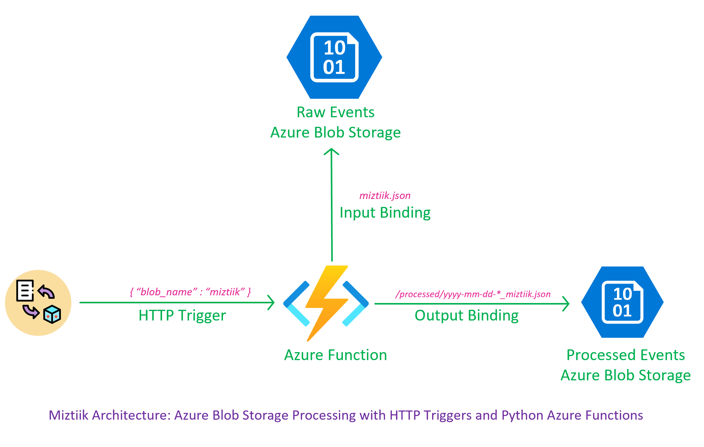
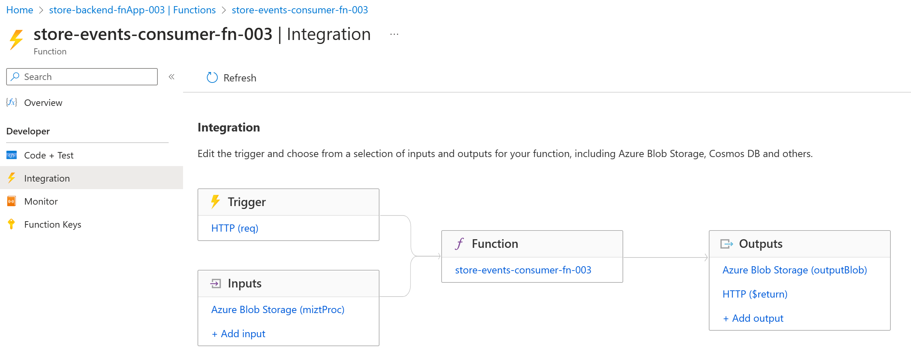
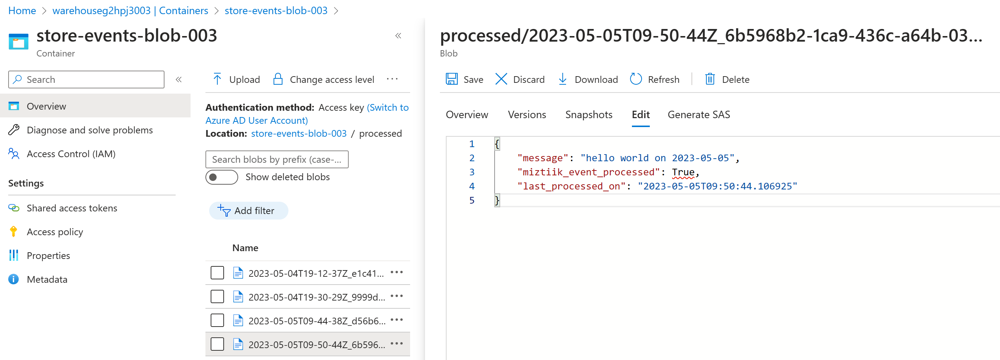
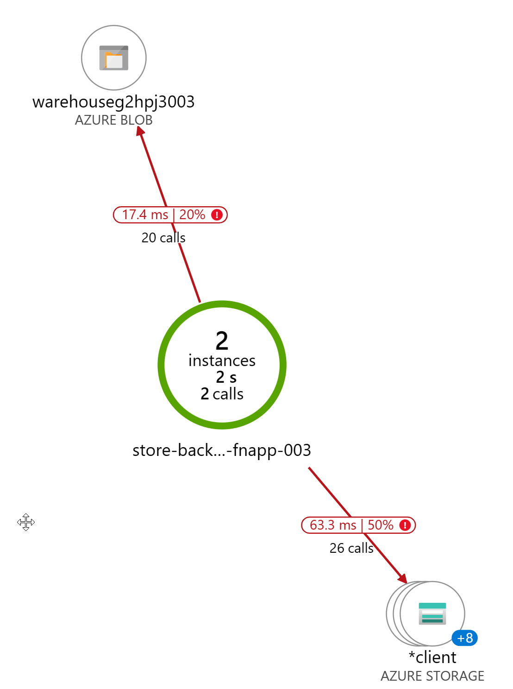
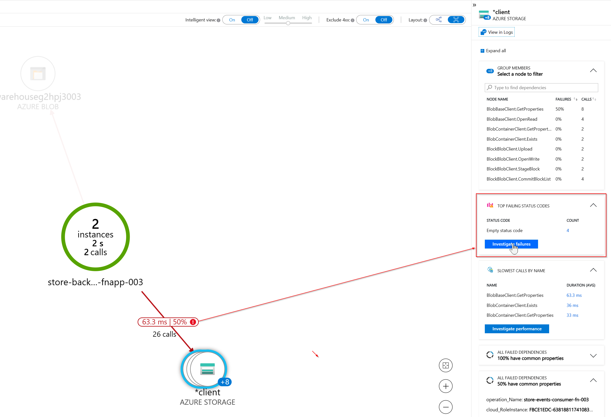
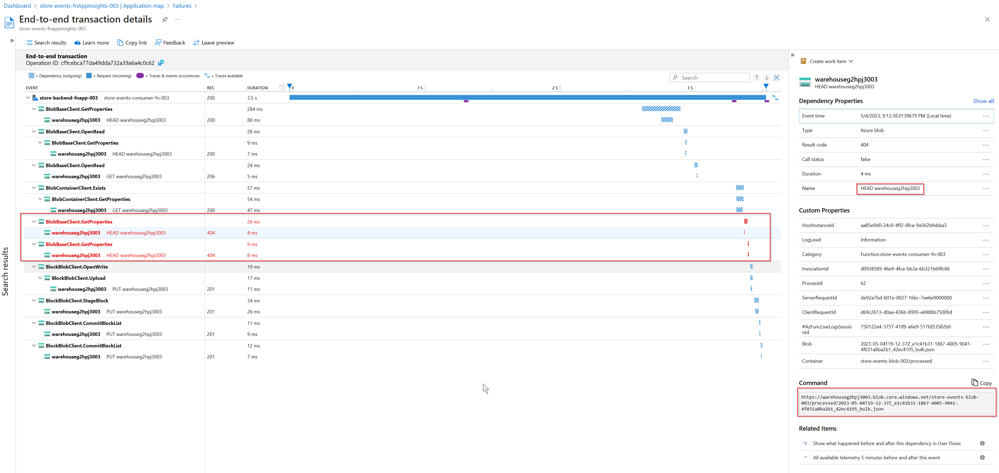
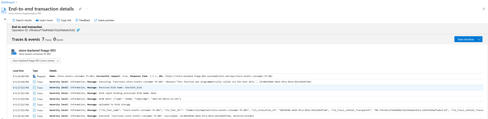

# Azure Blob Storage Processing with Python Azure Functions with HTTP Triggers

The developers at Mystique Unicorn [process files as soon as they arrive][5]. They want to switch to an event-driven architecture. They were looking for a custom trigger, whether it be payload-based or time-based, to process files efficiently.

They heard about Azure's capabilities for event processing. Can you help them implement this event processing at Mystique Unicorn? 



## 🎯 Solution

Our solution enables seamless event processing on Azure Blob Storage through the use of Azure Functions and [HTTP triggers][1]. With a simple HTTP payload containing the `blob_name`, the function can retrieve the corresponding blob using an [input binding][2] and process it accordingly. Our solution also includes an [output binding][3] to persist the processed event back to Blob Storage.

By leveraging the power of Bicep, all necessary resources can be easily provisioned and managed with minimal effort. Our solution uses Python for efficient event processing, allowing for quick and easy deployment of sophisticated event processing pipelines.

1. ## 🧰 Prerequisites

   This demo, instructions, scripts and bicep template is designed to be run in `westeurope`. With few or no modifications you can try it out in other regions as well(_Not covered here_).

   - 🛠 Azure CLI Installed & Configured - [Get help here](https://learn.microsoft.com/en-us/cli/azure/install-azure-cli)
   - 🛠 Bicep Installed & Configured - [Get help here](https://learn.microsoft.com/en-us/azure/azure-resource-manager/bicep/install)
   - 🛠 VS Code & Bicep Extenstions - [Get help here](https://learn.microsoft.com/en-us/azure/azure-resource-manager/bicep/install#vs-code-and-bicep-extension)

1. ## ⚙️ Setting up the environment

   - Get the application code

     ```bash
     https://github.com/miztiik/azure-blob-input-binding-to-function
     cd azure-blob-input-binding-to-function
     ```

1. ## 🚀 Prepare the environment

   Let check you have Azure Cli working with 

    ```bash
      # You should have azure cli preinstalled
      az account show
    ```

    You should see an output like this,

   ```json
    {
      "environmentName": "AzureCloud",
      "homeTenantId": "16b30820b6d3",
      "id": "1ac6fdbff37cd9e3",
      "isDefault": true,
      "managedByTenants": [],
      "name": "YOUR-SUBS-NAME",
      "state": "Enabled",
      "tenantId": "16b30820b6d3",
      "user": {
        "name": "miztiik@",
        "type": "user"
      }
    }
   ```

1. ## 🚀 Deploying the application

   - **Stack: Main Bicep**
     This will create the following resoureces
     - General purpose Storage Account with blob container
        - This will be used by Azure functions to store the function code
     - Storage Account with blob container - 
        - This will be used to store the events
     - Python Azure Function
        - Input, Trigger, Output Binding to the blob container for events

         

         ```bash
         # make deploy
         sh deployment_scripts/deploy.sh
         ```

    After successfully deploying the stack, Check the `Resource Groups/Deployments` section for the resources.

1. ## 🔬 Testing the solution

   - **Upload file(s) to blob**

      Get the storage account and container name from the output of the deployment. Upload a file to the container and check the logs of the function app to see the event processing in action.

      Sample bash script to upload files to blob container. You can also upload manually from the portal,
      ```bash
      FILE_NAME_PREFIX=$(openssl rand -hex 4)
      FILE_NAME="${RANDOM}_$(date +'%Y-%m-%d')_event.json"
      SA_NAME="warehouseg2hpj3003"
      CONTAINER_NAME="store-events-blob-003"
      echo -n "{\"message\": \"hello world on $(date +'%Y-%m-%d')\"}" > ${FILE_NAME}
      az storage blob upload \
        --account-name ${SA_NAME} \
        --container-name ${CONTAINER_NAME} \
        --name ${FILE_NAME} \
        --file ${FILE_NAME} \
        --auth-mode login
      ```

      Trigger the function with the following payload. You can also trigger the function from the portal,
      ```json
      {
        "blob_name": "29050_2023-05-05_event"
      }
      ```

      ```bash
      # Create JSON file
      echo -n "{\"name\": $RANDOM, \"timestamp\": \"$(date -u +"%Y-%m-%dT%H:%M:%SZ")\"}" > "${BLOB_NAME}"

      # Upload file to Azure Blob container
      az storage blob upload --account-name "${STORAGE_ACCOUNT}" \
      --container-name "${CONTAINER}" \
      --name "${BLOB_NAME}" \
      --file "${BLOB_NAME}" \
      --auth-mode login
      ```

      ```bash
      JSON_DATA='{"blob_name":"29050_2023-05-05_event"}'
      URL="https://store-backend-fnapp-003.azurewebsites.net/api/store-events-consumer-fn-003"
      curl -X POST \
         -H "Content-Type: application/json" \
         -d "${JSON_DATA}" \
         "${URL}"
      ```
      You should see an output like this,
      >Blob 29050_2023-05-05_event.json processed
       
      

1. ## 🔬 Observations

      This solution has also bootstrapped the function with applicaiton insights. This gives us a lot of insights on how the input/output bindings works. For example, when we look at the application map, we can see the calls made to the blob storage and also the percentage of success/failure. If we drill down the errors we can see the error code and the error message.

      

      
   
      

      We can observe that the output binding triggers a `HEAD` call to the storage account to check if the blob exists. It results in error `404` as the blob does not exist, it will create a new blob with the processed data.


      ```bash
      2023-05-04T19:12:38.0139679Z HEAD https://warehouseg2hpj3003.blob.core.windows.net/store-events-blob-003/processed/2023-05-04T19-12-37Z_e1c41b31-1867-4005-9041-4f031a8ba2b1_42ec4195_bulk.json
      2023-05-04T19:12:38.0417501Z HEAD https://warehouseg2hpj3003.blob.core.windows.net/store-events-blob-003/processed/2023-05-04T19-12-37Z_e1c41b31-1867-4005-9041-4f031a8ba2b1_42ec4195_bulk.json
      2023-05-04T19:12:38.0616047Z PUT  https://warehouseg2hpj3003.blob.core.windows.net/store-events-blob-003/processed/2023-05-04T19-12-37Z_e1c41b31-1867-4005-9041-4f031a8ba2b1_42ec4195_bulk.json
      ```

      

      _Ofcourse the screenshots and the data will be different, as they were taken during different file upload process_

     
1. ## 📒 Conclusion

    Here we have demonstrated trigger Azure functions with http trigger and process blob files. You can extend the solution and configure the function to send the events to other services like Event Hub, Service Bus, or persist them to Cosmos etc.
  

1. ## 🧹 CleanUp

If you want to destroy all the resources created by the stack, Execute the below command to delete the stack, or _you can delete the stack from console as well_

- Resources created during [Deploying The Application](#-deploying-the-application)
- _Any other custom resources, you have created for this demo_

```bash
# Delete from resource group
az group delete --name Miztiik_Enterprises_xxx --yes
# Follow any on-screen prompt
```

This is not an exhaustive list, please carry out other necessary steps as maybe applicable to your needs.

## 📌 Who is using this

This repository aims to show how to Bicep to new developers, Solution Architects & Ops Engineers in Azure.


### 💡 Help/Suggestions or 🐛 Bugs

Thank you for your interest in contributing to our project. Whether it is a bug report, new feature, correction, or additional documentation or solutions, we greatly value feedback and contributions from our community. [Start here](/issues)

### 👋 Buy me a coffee

[](https://ko-fi.com/Q5Q41QDGK) Buy me a [coffee ☕][900].

### 📚 References


1. [Azure Functions HTTP Trigger][1]
1. [Azure Blob Storage Input Binding][2]
1. [Azure Blob Storage Ouput Binding][3]
1. [Azure Functions Best Practices][4]
1. [Miztiik Blog - Blob Storage Event Processing with Python Azure Functions][5]


[1]: https://learn.microsoft.com/en-us/azure/azure-functions/functions-bindings-http-webhook-trigger?tabs=python-v1
[2]: https://learn.microsoft.com/en-us/azure/azure-functions/functions-bindings-storage-blob-input?tabs=python-v1
[3]: https://learn.microsoft.com/en-us/azure/azure-functions/functions-bindings-storage-blob-output?tabs=python-v1
[4]: https://learn.microsoft.com/en-us/azure/azure-functions/functions-best-practices
[5]: https://github.com/miztiik/azure-blob-trigger-python-function

### 🏷️ Metadata


**Level**: 100


[100]: https://www.udemy.com/course/aws-cloud-security/?referralCode=B7F1B6C78B45ADAF77A9
[101]: https://www.udemy.com/course/aws-cloud-security-proactive-way/?referralCode=71DC542AD4481309A441
[102]: https://www.udemy.com/course/aws-cloud-development-kit-from-beginner-to-professional/?referralCode=E15D7FB64E417C547579
[103]: https://www.udemy.com/course/aws-cloudformation-basics?referralCode=93AD3B1530BC871093D6
[899]: https://www.udemy.com/user/n-kumar/
[900]: https://ko-fi.com/miztiik
[901]: https://ko-fi.com/Q5Q41QDGK